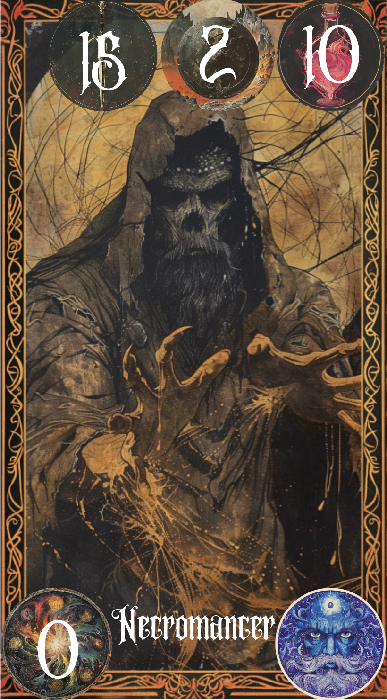
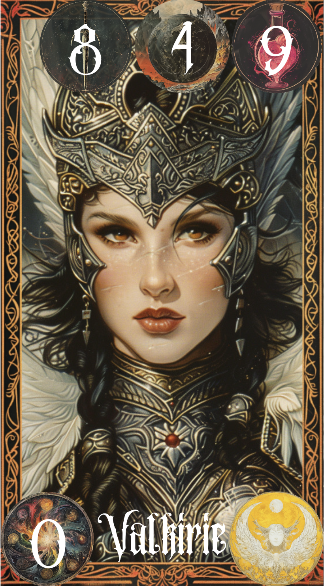
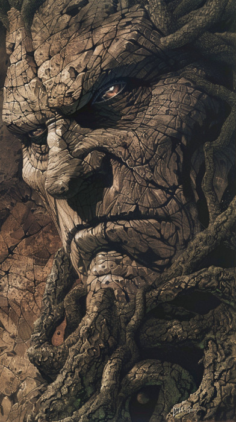
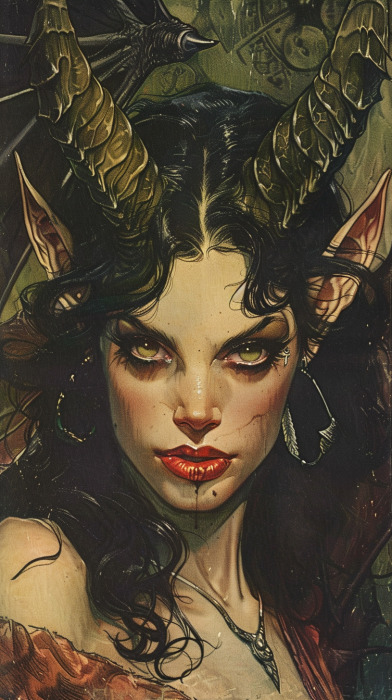
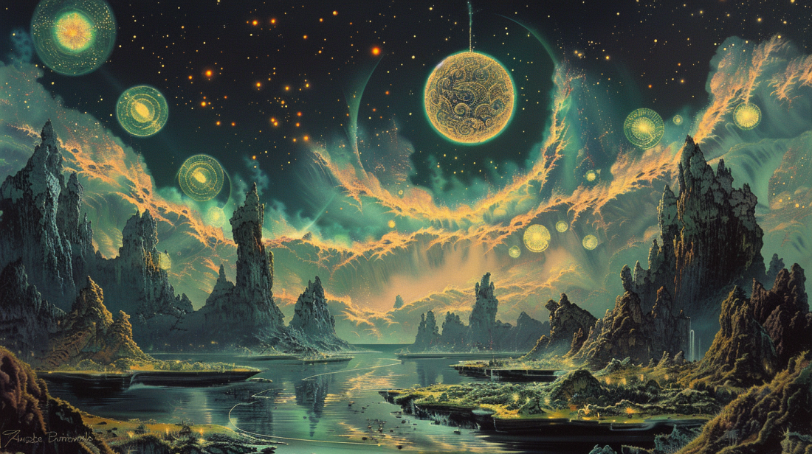
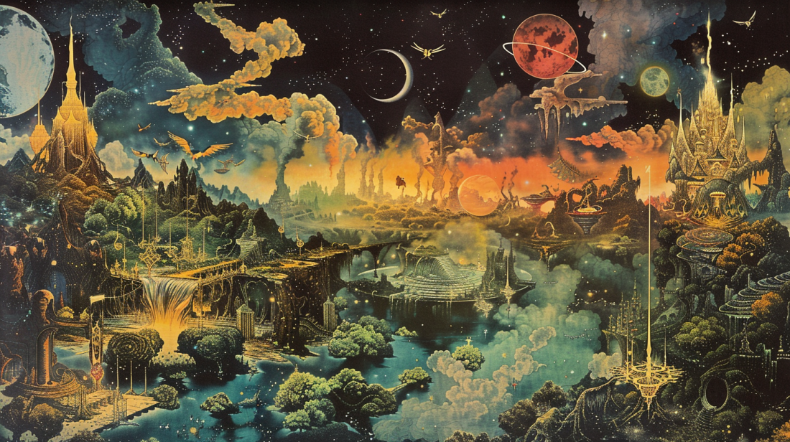

# **Awekening of the Realms**

## _Game Design Document_

---

##### **All Rights Reserved. Alberto Limón Cancino, Do Kyu Han Kim and Gabriel Edid Harari ©2024**

##

## _Index_

---

1. [Index](#index)
2. [Game Design](#game-design)
   1. [Summary](#summary)
   2. [Gameplay](#gameplay)
   3. [Mindset](#mindset)
3. [Technical](#technical)
   1. [Screens](#screens)
   2. [Controls](#controls)
   3. [Mechanics](#mechanics)
4. [Level Design](#level-design)
   1. [Themes](#themes)
      1. Ambience
      2. Objects
         1. Ambient
         2. Interactive
      3. Challenges
   2. [Game Flow](#game-flow)
5. [Development](#development)
   1. [Abstract Classes](#abstract-classes--components)
   2. [Derived Classes](#derived-classes--component-compositions)
6. [Graphics](#graphics)
   1. [Style Attributes](#style-attributes)
   2. [Graphics Needed](#graphics-needed)
7. [Sounds/Music](#soundsmusic)
   1. [Style Attributes](#style-attributes-1)
   2. [Sounds Needed](#sounds-needed)
   3. [Music Needed](#music-needed)
8. [Schedule](#schedule)

## _Game Design_

---

### **Summary**

Welcome to _Awakening of the Realms_, a captivating Deck Building Game where you will journey through diverse opponents and enchanting kingdoms. Embark on an adventure by selecting one of four distinct kingdoms, each offering unique benefits and challenges. Embrace the strengths of your chosen kingdom and engage in battle. Skillfully construct your deck, using the individual abilities of each card to strategize and adapt your approach with every turn. Immerse yourself in the game's dark fantasy aesthetic for an experience that promises to be truly unforgettable.

### **Gameplay**

Upon launching the game for the first time, players are asked to select one of four distinct realms: Human, Magic, Celestial (Angels and demons), and Monster. This initial choice is important for gameplay. The players kick off with three basic cards from all realms, this will lay the foundation for their initial matches. Progressing on the game the player would be able to assemble the deck as the player needs and would be able to get more and better cards. Before starting the matches the player would have to configure his deck up to 10 cards. Each deck can be configured with 10 commons. This deck configuration can be changed later when the player get more cards like the legendary cards and special cards, where the final deck composition would be 7 common cards 2 special cards and 1 legendary card. The player can configure the deck strategically and depending on the players gamestyle. Also players must adapt their strategies, choosing between aggressive or defensive tactics.

Battles are structured such that players start with six cards in hand, from which they can play up to two cards each turn. As the match progresses the player will keep on receiving a random cycle of the cards on his deck, this means that the card used in a round can appear again in the hand deck. Tactical thinking is essential, as players must decide whether to attack, defend, heal, or employ a mix of these strategies to deplete their opponent's health bar of 100 hit points. Similarly, players themselves have 100 hit points, with the potential to recover or even exceed this threshold through strategic play of healing cards. Also in order to use the legendary card the player must used 6 common and special cards, each card will give +1 energy. An energy gage would mark the amount of times you used common and special cards in the game, the energy resets after the player used the legendary card.

Matches unfold with each player's turn occurring simultaneously, governed by a timer for selecting two cards to play. Victory in a match awards the player XP points for card upgrades and 10 coins. The coins are able to be used in the game store, where the player can purchase a random card or a token to change the players realm. Further more in the store there can be special packages to buy. Upon purchasing the card, if its duplicate, converts the card into additional XP points, if its a new card then it will be permanently unlocked. Cards can only be upgraded when the full XP cost is met, ensuring upgrades cannot be partially applied.

This gaming mechanism promises to immerse players deeply in the enchanting universe of _Awakening of the Realms_, offering an extraordinary and engaging experience.

### **Mindset**

In our game, the primary aim is to evoke feelings of adventure, empowerment, and strategic thinking within the player. We plan to create these emotions through several key aspects:

**Empowerment:** Players are expected to feel a growing sense of empowerment and progression as they advance through the game. This is achieved by upgrading their cards and mastering their skills. The decision-making process involved in improving their deck and deploying cards in epic battles allows players to enjoy the thrill of overcoming obstacles and outsmarting their adversaries.

**Adventure:** The various realms within the game are designed to provide a spirit of adventure. Players have the autonomy to select their preferred realm and dive into the unique advantages it offers. Encounters with opponents from contrasting realms will prompt players to contemplate their realm choice, adding depth and intrigue to their journey.

**Strategy:** The diversity of cards available, each with its own set of statistics, encourages players to engage in strategic thinking and meticulous planning. Selecting the right cards, efficiently managing resources, and adapting to evolving scenarios are crucial elements that keep players absorbed and entertained from start to finish.

By weaving together these elements, our game aims to provide an immersive experience that challenges players intellectually while simultaneously offering them a sense of growth, exploration, and mastery.

## _Technical_

---

### **Screens**

1. Title Screen
   1. Create a user
      1. Select your realm and name
2. Inventory
   1. Deck Building
   2. Cards unlocked
3. Battle Selector
   1. Select you level
4. Match
   1. Arena
   2. Assessment / Go Back
5. End Credits

### **Controls**

Most of the controls the player will be able to do will be through the trackpad/mouse. The players will be able to click on buttons to access diferent screens, select their deck and go to a match. Inside a match players will be able to press on cards, drag them and place them in front of them to play them.

### **Mechanics**

The game would have 50 cards in total, where for each realm there would have 10 cards. From those cards 8 would be a commom card having different unique stats: Attack, Defense and Healing. Each card has their own unique set of stats:

1. Human Realm:

   | Character   | Attack | Defense | Healing |
   | ----------- | ------ | ------- | ------- |
   | Warrior     | 10     | 10      | 0       |
   | Archer      | 15     | 5       | 0       |
   | Cleric      | 2      | 2       | 15      |
   | Knight      | 5      | 15      | 0       |
   | Sorceress   | 10     | 1       | 9       |
   | Royal Guard | 12     | 20      | 0       |
   | Assasin     | 25     | 1       | 0       |
   | Mercenary   | 10     | 4       | 5       |

2. Monster Realm:

   | Character | Attack | Defense | Healing |
   | --------- | ------ | ------- | ------- |
   | Ogre      | 7      | 10      | 2       |
   | Basilisc  | 12     | 7       | 5       |
   | Werewolf  | 10     | 12      | 3       |
   | Goblin    | 3      | 5       | 10      |
   | Harpies   | 10     | 10      | 9       |
   | Troll     | 6      | 15      | 4       |
   | Treants   | 2      | 6       | 15      |
   | Ghoul     | 10     | 5       | 5       |

3. Magical Realm:

   | Character           | Attack | Defense | Healing |
   | ------------------- | ------ | ------- | ------- |
   | Giant               | 5      | 15      | 0       |
   | Elfs                | 10     | 5       | 5       |
   | Necromancer         | 15     | 2       | 10      |
   | Golem               | 1      | 20      | 0       |
   | Elemental guardians | 12     | 12      | 9       |
   | Dwarves             | 8      | 12      | 6       |
   | Wizard              | 14     | 4       | 10      |
   | Summoners           | 7      | 7       | 13      |

4. Celestial Realm:

   | Character         | Attack | Defense | Healing |
   | ----------------- | ------ | ------- | ------- |
   | Hell Hound        | 10     | 8       | 2       |
   | Archangel         | 14     | 10      | 0       |
   | Nephalem          | 10     | 5       | 10      |
   | Succubus          | 9      | 12      | 4       |
   | Voidshade Phantom | 14     | 2       | 0       |
   | Titans            | 1      | 15      | 5       |
   | Valkyries         | 8      | 4       | 9       |
   | celestial bug     | 0      | 2       | 20      |

From the rest of the 10 cards, the other 2 cards would be a legendary card. The legendary cards are different from the common cards, each of the legendary cards give you a special bonus effect and a more powerful main stats than the common cards.

1. Human Realm:

   | Character   | Attack | Defense | Healing | Special Ability  | Description                                                                                                                                                                              |
   | ----------- | ------ | ------- | ------- | ---------------- | ---------------------------------------------------------------------------------------------------------------------------------------------------------------------------------------- |
   | Princess    | 10     | 10      | 40      | Royal Grace      | Doubles the healing of the healers for 1 round (it doesnt double itself) and reduces two energy gage of the enemy player.                                                                |
   | King Arthur | 35     | 25      | 15      | Excalibur's fury | Ignore the defense of one of the enemy cards placed for 1 round (ex. if the defense is 30 this ability would ignore the defense and apply the damage direct to the health of the player) |

2. Monster Realm:

   | Character | Attack | Defense | Healing | Special Ability   | Description                                                                                                                                                    |
   | --------- | ------ | ------- | ------- | ----------------- | -------------------------------------------------------------------------------------------------------------------------------------------------------------- |
   | Griffin   | 30     | 30      | 10      | Soaring Vigilance | Can dodge one of the enemys card attacks and also after the dodge can see the enemys played cards for 2 rounds                                                 |
   | Dragon    | 40     | 20      | 10      | Inferno Breath    | Applies to the enemy a dot damage of 10 attack and the healing is 50% less effective for 3 rounds (if the enemy places a card that heals 20, it just heals 10) |

3. Magical Realm:

   | Character       | Attack | Defense | Healing | Special Ability   | Description                                                                                                                                                                                                                                                                                                  |
   | --------------- | ------ | ------- | ------- | ----------------- | ------------------------------------------------------------------------------------------------------------------------------------------------------------------------------------------------------------------------------------------------------------------------------------------------------------ |
   | Runeforge dwarf | 15     | 40      | 20      | Runic ward        | Creates a barrier for the alies that gives 50 defense for 2 rounds                                                                                                                                                                                                                                           |
   | Moonshadow Elf  | 35     | 15      | 20      | Lunar empowerment | Debuf the enemy making the attacks 20% weaker for 2 rounds and life steal 30 life points of the enemy (The life steal effect passes the amount of life steal from the enemy player to the player, in this case 30 would be decreasing to the enemy player's health and 30 would be increasing to the player) |

4. Celestial Realm:

   | Character       | Attack | Defense | Healing | Special Ability     | Description                                                                                                                            |
   | --------------- | ------ | ------- | ------- | ------------------- | -------------------------------------------------------------------------------------------------------------------------------------- |
   | Archangel Asmir | 35     | 25      | 20      | Celestial Resonance | Reflect all damage taken for 1 round and also heals 10 life points for 3 rounds                                                        |
   | Demon King      | 35     | 15      | 30      | Abyssal Dominion    | Double the damage of the ally cards for 1 round and curse the enemy causing 10 damage over time and 20% healing reduction for 2 rounds |

There are also 10 special cards that will benefit the players deck cards, where each of them will also have a unique bonus effect.

1. Special cards:

   | Character  | Description                                            |
   | ---------- | ------------------------------------------------------ |
   | Special 1  | Gives the player an Extra energy                       |
   | Special 2  | The attack of the card placed deals x2 for one turn    |
   | Special 3  | Posion the enemy player for 2 rounds dealing 20 damage |
   | Special 4  | Heals the player 30 health                             |
   | Special 5  | Cures all debuf applied to the player                  |
   | Special 6  | Enhance shields played x2                              |
   | Special 7  | Reduces enemy attack to 50%                            |
   | Special 8  | Damage taken will be reflected to the enemy            |
   | Special 9  | Disables an enemy card played                          |
   | Special 10 | You can see the opponents cards                        |

Cards are upgradable using XP points and can achieve up to three levels of enhancement. Also chosing the specific realm would benefit the player through out the battle:

- Human realm gives 30 more health and 10% more attack for every card to the player(meaning that the health threshold would be 130 hit points and the cards from the deck would benefit from an increase of damage).
- Celestial realm for every 3 turns it disables one of the enemy player card.
- Magic realm for every 2 turns steals one energy of the enemy.
- Monster realm for every 3 turns can place an extra card.

In order to use the legendary card, the players must collect 6 energy gage. Inside the game, the energy gage would be able to be collected by placing any common cards for a round (this means that each round if the player places the two cards of that round would gain one energy). There are also special effects that gives extra energy gage or reduces energy gage. The common cards wont cost any energy in order to use it. After using the legendary card, the energy gage of the player would reset.

### **Card Examples**

Here you can see four examples of cards from **all realms** and even a special card from one of the realms.

  

    <h2 style="font-size: 16px;">Necromancer from the Magic Realm!</h2>
    
  

  

    <h2 style="font-size: 16px;">King Arthur from the Human Realm!</h2>
    
  

  

    <h2 style="font-size: 16px;">Werewolf from the Monster Realm!</h2>
    
  

  

    <h2 style="font-size: 16px;">Valkyrie from the Celestial Realm!</h2>
    
  

These card desings are subject to changes or improvements.

Here are some image concepts (not cards):

  

    
  

  

    
  

**Game Play**

1. Main Menu:

   Players start on the main screen, offering various options: Play the game, customize the deck, and access the store. During account creation, players choose one of four realms, each providing unique buffs.

2. Deck Customization:

   - In the Inventory, players select and place desired cards in their deck. The inventory displays all unlocked cards. New accounts receive three common cards from each realm. Decks consist of 7 common, 2 special, and 1 legendary card. Common cards are limited to 10, with restrictions on special and legendary cards.

3. Level Selection:

   - Players choose an entry level, featuring three stages, including a boss stage. There are a total of eight levels, with increasing difficulty and rewards for victorious completion.

4. In-Game Interface:

   - Options include:
     - 4.1. Deck in Hand: Displays five randomly selected cards.
     - 4.2. Card Placement Section: Players can place two cards per round (There would be exeptions when a legendary card is used).
     - 4.3. Turn Timer: Each round lasts 60 seconds, ending when both players place cards or when the timer expires.
     - 4.4 Energy Display: Above the player's health bar, showing energy increase (up to 6) each round when placing a card.

5. Simultaneous Card Placement:

   - Players and the enemy simultaneously place cards each round. Card stats activate, and outcomes are determined once both players have played their cards.

   - Example:

     - Imagine you're Player 1 and you deploy two cards combining for 17 attack, 8 defense, and 2 healing. Once cards are played, their stats are activated. However, the outcome is uncertain until both players have played their cards. Suppose Player X plays two cards resulting in 10 attack, 25 defense, and no healing. The resolution is as follows:

       - Your 17 attack is fully absorbed by Player X's 25 defense, with their residual defense dissipating.

       - Your 8 defense successfully blocks 8 out of Player X's 10 attack, resulting in a mere 2 hit point loss.

       - Your healing boosts your health by 5, placing you 3 hit points above your starting total.

       - In the other turns those player would be able to place different common cards, special cards and legendary cards to get the victory of the game.

6. Legendary Card Usage:

   - Players can play a legendary card after playing six cards, with some special cards accelerating energy gain. Both players cant play legendary cards before the energy gage is full.

7. Victory Conditions:

   -To win, players must deplete the enemy player's health bar. Matches have a maximum of 10 rounds to manage game duration.

8. Rewards and Progression:

   - Winning rewards players with experience points and 10 coins.
     - Experience points are vital for card upgrades.
     - Coins can be used in the store. In the store, players can buy random cards, if a duplicate is received, it converts into experience points. with coins the player can also purchase a token allowing to choose a new realm.

## _Level Design_

---

In order for the user to experience a sense of discovery, mystery and progressión we have decided to implement 4 boards. Each board corresponds to one of the four realms and each realm is intended to have 2 levels. An entry level and the boss challenge. The design of the boards will be as follows.

### **Themes**

1. Magical Realm: The Enchanted Grounds

   1. Mood
      1. Mystical, serene, captivating
   2. Objects
      1. Ambient
         1. Floating islands
         2. Auroras
         3. Arcane runes

2. Celestial Realm: The Celestial Fields

   1. Mood
      1. calm, powerful, peace
   2. Objects
      1. Ambient
         1. Gold details
         2. Clouds
         3. Angelic beings

3. Human Realm: The Kingdom's place

   1. Mood
      1. Heroic, bustling, medieval
   2. Objects
      1. Ambient
         1. Flags of the realm
         2. Castle towers
         3. Shields and swords

4. Monster Realm: The Dark Forest
   1. Mood
      1. Untamed, mysterious, dark
   2. Objects
      1. Ambient
         1. Tall dark trees
         2. Fog at the edges
         3. Glowing red eyes in the dark

Here is an example of have the scenario from the **Magic Realm** would look like (subject to changes):

All other realms will have a similar styled background for the matches.

### **Game Flow**

1. (First time opening) Player selects its name and realm.
2. Player enters his card collection and deck builiding screen.
3. Player enters the level selection screen.
4. Player chooses a level to fight in.
5. Level is selected.
6. Player is redirected to the level screen.
7. Player is displayed with a the specific board of the Realm in which he the level is located.
8. The match starts.

   1. Matches unfold with each player's turn occurring simultaneously, governed by a timer for selecting two cards to play.
   2. A match would look like this:  
      Imagine you're Player 1 and you deploy two cards combining for 17 attack, 8 defense, and 2 healing. Once cards are played, their stats are activated. However, the outcome is uncertain until both players have played their cards.
      Suppose Player X plays two cards resulting in 10 attack, 25 defense, and no healing. The resolution is as follows:

      Your 17 attack is fully absorbed by Player X's 25 defense, with their residual defense dissipating.

      Your 8 defense successfully blocks 8 out of Player X's 10 attack, resulting in a mere 2 hit point loss.

      Your healing boosts your health by 5, placing you 3 hit points above your starting total.

9. Once the match is over the player collects his rewards.

   1. If the player won it will get a random card and XP points, if the player already has that card it will convert to XP.
   2. If the player lost it will only get some XP points.

10. Player is redirected to the main screen (select level screen).

Here is an example of how the main screen will look like when the game opens (subject to changes), we wanted to a sneak peak of all 4 realms:

## _Development_

---

### **Abstract Classes / Components**

1. Card
   1. Attack
   2. Defense
   3. Healing
   4. Special habilities
   5. Power needed
   6. Rarity
   7. Realm
   8. Level
2. Realm
   1. Theme
   2. Elements
   3. Bonuses
3. Player
   1. Name
   2. Realms
   3. Health
   4. Power
   5. Current deck
4. Opponent/NPC/Enemy
   1. Health
   2. Realm
   3. Power
   4. Current deck
   5. Attack patterns
5. Game Manager
6. UIManager
7. Battle Controller
8. Card Database
9. Player Data

### **Derived Classes / Component Compositions**

1. Card Derivatives
   1. Common
   2. Realm specials
   3. Special cards
2. Realm Derivatives
   1. Human
   2. Monster
   3. Celestial
   4. Magic
3. Opponent Derivatives
   1. BasicEnemy
   2. BossEnemy

## _Graphics_

---

### **Style Attributes**

For _Awakening of the Realms_ we will be having a rich and immersive color palette that reflects the dark fantasy aesthetic of the game. Each Realm (levels) will have its own distinct color scheme to have its unique characteristics present. The Human Realm will have warm and earth-like tones. The Magic Realm will have cold and mystical colors. The celestial Realm will have white and gold details. The Monster Realm will have dark shadow colors and green.

The artistic style is based on a combination between fantasy and a semi-realistic scenario. Environments and cards will have fantasy characteristics that relate to realistic features. For example; an archer will have realistic features mixed with some fantasy attributes. We intend to generate all cards using the AI _MidJourney_, one of the best in the market for image generation. This AI will ensure all cards have a similar realistic but a paper and grainy look to them.

Finally, we intend to implement effects to indicate the interactivity in the game. Maybe adding some glow effects, shadows when a card is played, when damage is done or taken and shine when the player heals.

### **Graphics Needed**

1. Realms

   1. When a player decides to enter an specific realm level, each level will have its unique environment that aligns with its theme.
   2. Realms environment
      1. Human Realm: medevial theme. (castles, swords, shields, flags)
      2. Celestial Realm: celestial theme. (high red colors, fictional beings)
      3. Magical Realm: magical theme. (mist, blue tones, fictional beings)
      4. Monster Realm: dark forest theme. (dark colors, small red lights, fog)

2. Cards

   1. Different and unique traits for each one. Each card should reflect the unique traits and aesthetic of their respective realm.

3. UI elements

   1. Multiple scenes
   2. Navigation between scenes
   3. Loading screens (if needed)
   4. Styled buttons

4. Realm Selection
   1. Representation of the 4 realms to choose. 4 unique images when choosing a Realm with their description.

## _Sounds/Music_

---

### **Style Attributes**

The primary audio experience will revolve around a captivating medieval/fantasy backdrop, enriched with the melodic resonance of fundamental instruments such as the guitar and piano. During tranquil moments in the game, the audio will evoke a sense of serenity, immersing players in a soothing ambiance. However, as players transition into intense gameplay scenarios, the audio dynamically shifts, enveloping them in an immersive battle atmosphere.

The game's audio landscape will be characterized by enchanting sound effects and musical compositions, seamlessly intertwining to evoke a magical and adventurous ambiance. Each note and sound element will contribute to a cohesive and evocative auditory journey, enhancing the overall gaming experience and drawing players deeper into the fantastical realms of the medieval world.

### **Sounds Needed**

1. Effects
   1. Swords clashing
   2. Explotions
   3. Spell forming (whooshing sound)
   4. Shield breaking (wood or metal break)
   5. Shiel protecing (something rebounding)
   6. Healing (angelical sound, chorus)
   7. Match Win (victorious music)
   8. Match Loose (sad music)
   9. Recieve a new card (cheer sound)
2. Feedback
   1. Button Press (click sound)
   2. Hold and drop chime

### **Music Needed**

1. Medieval Epic music
2. Intense, exciting music and &quot;dangerous&quot; track
3. Calm, relaxed and happy track
4. Cheerful and &quot;victorious&quot; track
5. Sad and &quot;defeated&quot; track

## _Schedule_

---

1. Phase one (22-03-2024)

   1. Database
      1. Modify the existing Entity-Relation to add changes and corrections
      2. Define user stories
      3. Set up unity project and integrate basic UI elements.
   2. Website
      1. Understand how to create an API and link the cards.
   3. General
      1. Finish the GDD and add modifications if necessary.

2. Phase two (29-03-2024)

   1. Database
      1. Define the database schema for entities.
      2. Implement the database tables with their necessary relations.
   2. Website
      1. Develop the API for operations on the database entities.
      2. Implement all necessary protocols ( authentication and authorization if needed)

3. Phase three (05-04-2024)

   1. Unity
      1. Implement basic backend logic. (minimal viable setup)
   2. Website
      1. Integrate the API with Unity
   3. Data base
      1. Fill the data base will all the cards, realations and necessary tables.

4. Phase four (12-04-2024)

   1. Visual elements
      1. Design the visual elements for the cards, levels, and screens.
      2. Start implementing game logic with cards in unity.
   2. Website
      1. Test if the API is working properly with unity and the database.

5. Phase five (19-04-2024)

   1. Unity
      1. Develop the advanced game logic and mechanics. (update the minimal viable setup)
      2. Improve the UI/UX elements if needed
      3. Integrate all the visual assets.

6. Phase six (26-04-2024)

   1. Test the game
   2. Improve the game if necessary.
