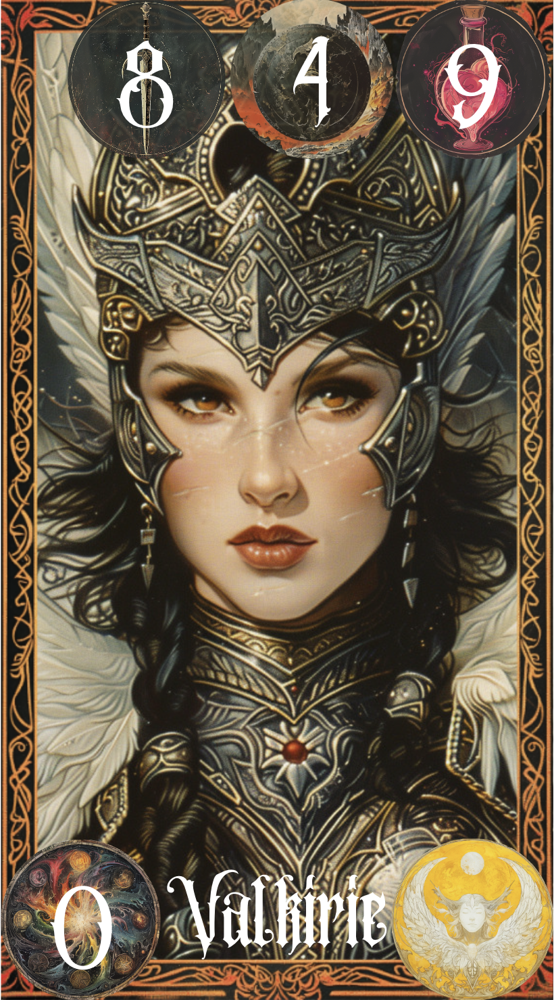

# **Awekening of the Realms**

## _Game Design Document_

---

##### **All Rights Reserved. Alberto Limón Cancino, Do Kyu Han Kim and Gabriel Edid Harari ©2024**

##

## _Index_

---

1. [Index](#index)
2. [Game Design](#game-design)
   1. [Summary](#summary)
   2. [Gameplay](#gameplay)
   3. [Mindset](#mindset)
3. [Technical](#technical)
   1. [Screens](#screens)
   2. [Controls](#controls)
   3. [Mechanics](#mechanics)
4. [Level Design](#level-design)
   1. [Themes](#themes)
   2. [Game Flow](#game-flow)
5. [Development](#development)
   1. [Abstract Classes](#abstract-classes--components)
   2. [Derived Classes](#derived-classes--component-compositions)
6. [Graphics](#graphics)
   1. [Style Attributes](#style-attributes)
   2. [Graphics Needed](#graphics-needed)
7. [Sounds/Music](#soundsmusic)
   1. [Style Attributes](#style-attributes-1)
   2. [Sounds Needed](#sounds-needed)
   3. [Music Needed](#music-needed)
8. [Schedule](#schedule)

## _Game Design_

---

### **Summary**

Welcome to _Awakening of the Realms_, a captivating Deck Building Game where you will journey through diverse opponents and enchanting kingdoms. Embark on an adventure by selecting one of four distinct kingdoms, each offering unique benefits and challenges. Embrace the strengths of your chosen kingdom and engage in battle. Skillfully construct your deck, using the individual abilities of each card to strategize and adapt your approach with every turn. Immerse yourself in the game's dark fantasy aesthetic for an experience that promises to be truly unforgettable.

### **Gameplay**

Upon launching the game for the first time, players are asked when creating a user to select one of four distinct realms: Human, Magic, Celestial, and Monster. This initial choice is important for gameplay. The players kick off with three basic cards from all realms, this will lay the foundation for their initial matches. Progressing on the game the player would be able to assemble the deck as the player needs and would be able to get more and better cards. Before starting the matches the player would have to configure his deck up to 10 cards. Each deck can be configured with 10 cards composing of 8 common and 2 legendary cards. The player can configure the deck strategically and depending on the players gamestyle. Also players must adapt their strategies, choosing between aggressive or defensive tactics.

Battles are structured such that players start with five cards in hand, from which they can play up to two cards each turn. As the match progresses the player will keep on receiving a random cycle of the cards on his deck, this means that the card used in a round can appear again in the hand deck. Tactical thinking is essential, as players must decide whether to attack, defend, heal, or employ a mix of these strategies to deplete their opponent's health bar of 100 hit points. Similarly, players themselves have 100 hit points, with the potential to recover or even exceed this threshold through strategic play of healing cards. Also in order to use legendary cards the player must have enough energy, each turn will give +1 energy. An energy gage would show the amount of energy avialble, the energy goes down after the player used the legendary card.

Matches unfold with each player's turn occurring simultaneously, so both players must select two cards to play. Victory in a match awards the players 450 coins for buying new cards in the game shop. Upon purchasing the card it will be permanently unlocked on the player's inventory. Also, beating your oponent will open the next level for the player, but be aware that beating the same level multiple times won't give you coins.

This gaming mechanism promises to immerse players deeply in the enchanting universe of _Awakening of the Realms_, offering an extraordinary and engaging experience.

### **Mindset**

In our game, the primary aim is to evoke feelings of adventure, empowerment, and strategic thinking within the player. We plan to create these emotions through several key aspects:

**Empowerment:** Players are expected to feel a growing sense of empowerment and progression as they advance through the game. This is achieved by unlocking new cards and mastering their skills. The decision-making process involved in improving their deck and deploying cards in epic battles allows players to enjoy the thrill of overcoming obstacles and outsmarting their adversaries.

**Adventure:** The various realms within the game are designed to provide a spirit of adventure. Players have the autonomy to select their preferred realm and dive into the unique advantages it offers. Encounters with opponents from contrasting realms will prompt players to contemplate their realm choice, adding depth and intrigue to their journey.

**Strategy:** The diversity of cards available, each with its own set of statistics, encourages players to engage in strategic thinking and meticulous planning. Selecting the right cards, efficiently managing resources, and adapting to evolving scenarios are crucial elements that keep players absorbed and entertained from start to finish.

By weaving together these elements, our game aims to provide an immersive experience that challenges players intellectually while simultaneously offering them a sense of growth, exploration, and mastery.

## _Technical_

---

### **Screens**

1. Title Screen
1. Create a user
   1. Select your realm
1. Log In
   1. Enter to your already created account
1. Main Screen
   1. Navigation between screens
1. Shop
   1. Buying cards
1. Inventory
   1. Build your deck
   1. See unlocked cards
1. Battle Selector
   1. Select you level
1. Match
   1. Arena
   1. Multiple sceneries
1. Game Over
   1. Assesment from the battle

### **Controls**

Most of the controls the player will be able to do will be through the trackpad/mouse. The players will be able to click on buttons to access diferent screens, select their deck and go to a match. Inside a match players will be able to press on cards, drag them and place them in front of them to play them. The keyboard will only be used when logging in or creating an account.

### **Mechanics**

The game would have 50 cards in total, where for each realm there would have 10 cards. From those 10 cards, 8 would be commom and 2 will be legendary. All cards have different unique stats: Attack, Defense and Healing. Each card has their own set of stats:

1. Human Realm:

   | Character   | Attack | Defense | Healing |
   | ----------- | ------ | ------- | ------- |
   | Warrior     | 5      | 5       | 5       |
   | Archer      | 10     | 5       | 0       |
   | Cleric      | 2      | 3       | 10      |
   | Knight      | 3      | 10      | 2       |
   | Sorceress   | 12     | 0       | 3       |
   | Royal Guard | 6      | 9       | 0       |
   | Assasin     | 15     | 0       | 0       |
   | Mercenary   | 6      | 4       | 5       |

2. Monster Realm:

   | Character | Attack | Defense | Healing |
   | --------- | ------ | ------- | ------- |
   | Ogre      | 4      | 6       | 5       |
   | Basilisc  | 3      | 6       | 6       |
   | Werewolf  | 7      | 3       | 5       |
   | Goblin    | 8      | 2       | 5       |
   | Harpies   | 13     | 1       | 1       |
   | Troll     | 0      | 12      | 3       |
   | Treant    | 1      | 1       | 13      |
   | Ghoul     | 11     | 4       | 0       |

3. Magical Realm:

   | Character          | Attack | Defense | Healing |
   | ------------------ | ------ | ------- | ------- |
   | Giant              | 0      | 12      | 3       |
   | Elf                | 14     | 1       | 0       |
   | Necromancer        | 12     | 2       | 1       |
   | Golem              | 2      | 12      | 1       |
   | Elemental Guardian | 5      | 5       | 5       |
   | Dwarves            | 4      | 8       | 3       |
   | Witch              | 10     | 3       | 2       |
   | Dark Wizard        | 8      | 0       | 7       |

4. Celestial Realm:

   | Character  | Attack | Defense | Healing |
   | ---------- | ------ | ------- | ------- |
   | Hell Hound | 12     | 2       | 1       |
   | Archangel  | 9      | 1       | 5       |
   | Nephalem   | 6      | 4       | 5       |
   | Succubus   | 1      | 5       | 9       |
   | Nymph      | 0      | 1       | 14      |
   | Titan      | 1      | 14      | 0       |
   | Valkyrie   | 12     | 1       | 2       |
   | Pegasus    | 4      | 6       | 5       |

The legendary cards are different from the common cards, each of the legendary cards give you a special bonus effect and a more powerful main stats than the common cards.

1. Human Realm:

   | Character   | Attack | Defense | Healing | Special Ability  | Description                                                                                                                                                                                |
   | ----------- | ------ | ------- | ------- | ---------------- | ------------------------------------------------------------------------------------------------------------------------------------------------------------------------------------------ |
   | Princess    | 10     | 10      | 40      | Royal Grace      | Doubles the healing of the healers for 1 round (it doesn't double itself) and reduces two energy gage of the enemy player.                                                                 |
   | King Arthur | 35     | 25      | 15      | Excalibur's Fury | Ignores the defense of one of the enemy cards placed for 1 round (ex. if the defense is 30 this ability would ignore the defense and apply the damage direct to the health of the player). |

2. Monster Realm:

   | Character | Attack | Defense | Healing | Special Ability   | Description                                                                                                                                                     |
   | --------- | ------ | ------- | ------- | ----------------- | --------------------------------------------------------------------------------------------------------------------------------------------------------------- |
   | Griffin   | 30     | 30      | 10      | Soaring Vigilance | Can dodge one of the enemy's card attacks and also after the dodge can see the enemy's played cards for 2 rounds.                                               |
   | Dragon    | 40     | 20      | 10      | Inferno Breath    | Applies to the enemy a dot damage of 10 attack and the healing is 50% less effective for 3 rounds (if the enemy places a card that heals 20, it just heals 10). |

3. Magical Realm:

   | Character       | Attack | Defense | Healing | Special Ability   | Description                                                                                                                                                                                                                                                                                                    |
   | --------------- | ------ | ------- | ------- | ----------------- | -------------------------------------------------------------------------------------------------------------------------------------------------------------------------------------------------------------------------------------------------------------------------------------------------------------- |
   | Runeforge Dwarf | 15     | 40      | 20      | Runic Ward        | Creates a barrier for the allies that gives 50 defense for 2 rounds.                                                                                                                                                                                                                                           |
   | Moonshadow Elf  | 35     | 15      | 20      | Lunar Empowerment | Debuff the enemy making the attacks 20% weaker for 2 rounds and life steal 30 life points of the enemy (The life steal effect passes the amount of life steal from the enemy player to the player, in this case 30 would be decreasing to the enemy player's health and 30 would be increasing to the player). |

4. Celestial Realm:

   | Character  | Attack | Defense | Healing | Special Ability     | Description                                                                                                                               |
   | ---------- | ------ | ------- | ------- | ------------------- | ----------------------------------------------------------------------------------------------------------------------------------------- |
   | Hercules   | 35     | 25      | 20      | Celestial Resonance | Reflects all damage taken for 1 round and also heals 10 life points for 3 rounds.                                                         |
   | Demon King | 35     | 15      | 30      | Abyssal Dominion    | Doubles the damage of the ally cards for 1 round and curses the enemy causing 10 damage over time and 20% healing reduction for 2 rounds. |

Chosing a specific realm when creating a user will benefit the player through out the battle:

- Human realm gives 15% bonus attack for every card.
- Celestial realm gives 15% bonus health for every card.
- Magic realm steals every 2 turns one energy of the enemy.
- Monster realm max health limit is increased by 30 (130 total).

In order to use the legendary card, the players must collect enough energy gage, some lengendary cards cost 3 and others 4. Inside the game, the energy gage would be able to be collected by finishing turns. There are also special effects that gives extra energy gage or reduces energy gage. The common cards wont cost any energy in order to use them.

### **Card Examples**

Here you can see four examples of cards from **all realms** and even a legendary card from one of the realms.

  

    <h2 style="font-size: 16px;">Necromancer from the Magic Realm!</h2>
    
  

  

    <h2 style="font-size: 16px;">King Arthur from the Human Realm!</h2>
    
  

  

    <h2 style="font-size: 16px;">Werewolf from the Monster Realm!</h2>
    
  

  

    <h2 style="font-size: 16px;">Valkyrie from the Celestial Realm!</h2>
    
  

These card desings are subject to changes or improvements.

Here are some image concepts (not cards):

  

    
  

  

    
  

**Game Play**

1. Menu:

   - The player is welcomed and asked to log in or create an account. In either screen the player is asked to provide information. When creating a user the player is asked to select a realm.

1. Main Menu:

   - Players get to the main screen, offering various options: Play the game, customize the deck, and access the store. The player must create a deck before selecting a level.

1. Deck Customization:

   - In the Inventory, players select and place desired cards in their deck. The inventory displays all unlocked cards. New accounts receive 16 random cards. Decks consist of 8 common and 2 legendary card.

1. Level Selection:

   - Players choose a level, each realm has 2 levels giving a total of eight levels. Any victory provides 450 coins.

1. In-Game Interface:

   - Options include:
     - 4.1 Deck in Hand: Displays five randomly selected cards.
     - 4.2 Card Placement Section: Players can place two cards per round.
     - 4.3 Turns: Each turns ends when both players place cards.
     - 4.4 Energy Display: Below the player's health bar, showing energy increases each round.

1. Simultaneous Card Placement:

   - Players and the enemy simultaneously place cards each round. Card stats activate, and outcomes are determined once both players have played their cards.

   - Example:

     - Imagine you're Player 1 and you deploy two cards combining for 17 attack, 8 defense, and 2 healing. Once cards are played, their stats are activated. However, the outcome is uncertain until both players have played their cards. Suppose Player X plays two cards resulting in 10 attack, 25 defense, and no healing. The resolution is as follows:

       - Your 17 attack is fully absorbed by Player X's 25 defense, with their residual defense dissipating.

       - Your 8 defense successfully blocks 8 out of Player X's 10 attack, resulting in a mere 2 hit point loss.

       - Your healing boosts your health by 5, placing you 3 hit points above your starting total.

       - In the other turns players will be able to place different common cards and legendary cards to get the best combinations that end up on a victories.

1. Legendary Card Usage:

   - Players can play a legendary card when they have enough energy to cover the cost. Both players cant play legendary cards before they fulfill the requirement.

1. Victory Conditions:

   - To win, players must deplete the enemy player's health bar.

1. Rewards and Progression:

   - Winning rewards players with 450 coins.
     - Coins can be used in the Shop where players can buy random new cards.

## _Level Design_

---

In order for the user to experience a sense of discovery, mystery and progressión we have decided to implement 8 seceneries. Each scenery corresponds to one of the four realms and each realm is intended to have 2 levels. The design of the sceneries will be as follows.

### **Themes**

1. Magical Realm: The Enchanted Grounds

   1. Mood
      1. Mystical, serene, captivating
   2. Objects
      1. Ambient
         1. Floating islands
         2. Auroras
         3. Arcane runes

2. Celestial Realm: The Celestial Fields

   1. Mood
      1. calm, powerful, peace
   2. Objects
      1. Ambient
         1. Gold details
         2. Clouds
         3. Angelic beings

3. Human Realm: The Kingdom's place

   1. Mood
      1. Heroic, bustling, medieval
   2. Objects
      1. Ambient
         1. Flags of the realm
         2. Castle towers
         3. Shields and swords

4. Monster Realm: The Dark Forest
   1. Mood
      1. Untamed, mysterious, dark
   2. Objects
      1. Ambient
         1. Tall dark trees
         2. Fog at the edges
         3. Glowing red eyes in the dark

Here is an example of the scenario from the **Magic Realm** would look like (subject to changes):

All other realms will have a similar styled background for the matches.

### **Game Flow**

1. (First time opening) Player creates a user and selects a realm.
2. Player enters his card collection and deck builiding screen.
3. Player enters the level selection screen.
4. Player chooses a level to fight in.
5. Level is selected.
6. Player is redirected to the level screen.
7. Player is displayed with a the specific scenery of the Realm in which the level is located.
8. The match starts.

   1. Matches unfold with each player's turn occurring simultaneously.

   2. A match would look like the one described before.

9. Once the match is over the player collects his rewards.

   1. If the player won it will 450 coins and unlock the next level.
   2. If the player lost it will get nothing.

10. Player is redirected to the main screen.

Here is an example of how the main screen will look like when the game opens (subject to changes), we wanted to a sneak peak of all 4 realms:

## _Development_

---

### **Abstract Classes / Components**

1. Card
   1. card_id
   2. card_name
   3. description
   4. attack
   5. defense
   6. healing
   7. card_realm
   8. power_cost
   9. rarity
   10. effect_type
   11. unlocked
   12. uniqueID
2. Game
   1. playerDeck
   2. gameState currrent state
   3. aifunction
   4. PlayerHealth
   5. PlayerEnergy
   6. cartasEnJuegoJugador
   7. cartasEnJuegoAI
   8. turns
   9. totalAttackPlayer, totalDefense, totalHealing
   10. totalAttackAI, totalDefense, totalHealing
   11. PlayerEffects, AIEffects
   12. gameScene
3. AI
   1. deckAI
   2. cardAI
   3. personality
4. Inventory
   1. cardDisplayManager
   2. playerInventory
   3. availableCards
5. User
   1. player_ID
   2. player_name
   3. player_last_name
   4. player_age
   5. user_name
   6. password
   7. realm
   8. is_npc
   9. level
   10. win_record
   11. lose_record
   12. coins
   13. token
6. APIConnection
   1. apiURL
7. AudioManager
   1. audioInstance
   2. audioSource
8. Shop
   1. buy
   2. response
   3. coins
   4. unlocked
9. CardDisplayManager
   1. prefab
   2. instance
10. Effects
    1. playerEffect
    2. aiEffect
    3. effectName
    4. effectDescription
11. Game Over
    1. stats
    2. messages
    3. coins
    4. apiConnection
12. Level
    1. name
    2. aiLevel
    3. background
    4. playerEnergy
    5. aiEnergy
    6. realm

### **Derived Classes / Component Compositions**

1. Card Derivatives

   1. CommonCard
   2. LegendaryCard
   3. AttackCard
   4. DefenseCard
   5. HealingCard
   6. MagicCard
   7. HumanCard
   8. MonsterCard
   9. CelestialCard

2. Game Derivatives

   1. Monster Level
   2. Human Level
   3. Celestial Level
   4. Magic Level

3. AI Derivatives

   1. AggressiveAI
   2. DefensiveAI
   3. BalancedAI

4. Inventory Derivatives

   1. Player Inventory
   2. Unlocked Cards
   3. Blocked Cards

5. User Derivatives

   1. PlayerUser
   2. AIUser

6. APIConnection Derivatives

   1. GameAPIConnection

7. AudioManager Derivatives

   1. MusicManager
   2. ButtonManager

8. Shop Derivatives
   1. ItemShop

## _Graphics_

---

### **Style Attributes**

For _Awakening of the Realms_ we will be having a rich and immersive color palette that reflects the dark fantasy aesthetic of the game. Each Realm (levels) will have its own distinct color scheme to have its unique characteristics present. The Human Realm will have warm and earth-like tones. The Magic Realm will have blue, purple, cold and mystical colors. The celestial Realm will have white and gold details. The Monster Realm will have dark shadow colors and reds.

The artistic style is based on a combination between fantasy and a semi-realistic scenario. Environments and cards will have fantasy characteristics that relate to realistic features. For example; an archer will have realistic features mixed with some fantasy attributes. We intend to generate all cards using the AI _MidJourney_, one of the best in the market for image generation. This AI will ensure all cards have a similar realistic but a paper and grainy look to them. All the prompts for image generation will be sourced from the AI _ChatGPT_.

### **Graphics Needed**

1. Realms

   1. When a player decides to enter an specific realm level, each level will have its unique environment that aligns with its theme.
   2. Realms environment
      1. Human Realm: medieval theme. (castles, swords, shields, flags)
      2. Celestial Realm: celestial theme. (gold colors, fictional beings)
      3. Magical Realm: magical theme. (mist, blue tones, fictional beings)
      4. Monster Realm: dark forest theme. (dark colors, small red lights, fog)

2. Backgrounds

   1. Images for all the sceneries and different scenes.

3. Cards

   1. Different and unique traits for each one. Each card should reflect the unique traits and aesthetic of their respective realm.

4. UI elements

   4. Styled buttons
   1. Styled dropdowns
   1. Styled containers

5. Realms

   1. Representation of the 4 realms to choose with their backgrounds and styles in images.

## _Sounds/Music_

---

### **Style Attributes**

The primary audio experience will revolve around a captivating medieval/fantasy backdrop, enriched with the melodic resonance of fundamental instruments such as drums, horns, trumpets and old guitas. During non-match moments in the game, the audio will evoke a sense of adventure, immersing players in an epic journey. However, as players transition into intense gameplay scenarios, the audio dynamically shifts, enveloping them in an immersive battle atmosphere.

The game's audio landscape will be characterized by enchanting sound effects and musical compositions, seamlessly intertwining to evoke a magical and adventurous ambiance. Each note and sound element will contribute to a cohesive and evocative auditory journey, enhancing the overall gaming experience and drawing players deeper into the fantastical realms of the medieval world.

### **Sounds Needed**

1. Feedback (for buttons)
   1. Sword unsheathing
   1. Dager sharpening
   1. Trumpets
   1. Coins rattling

### **Music Needed**

1. Dark Fantasy music
2. Intense, exciting music for a match
3. Market and curious music.
4. Dungeon and heavy music
5. Cheerful and &quot;victorious&quot; track
6. Sad and &quot;defeated&quot; track

## _Schedule_

---

1. Phase one (22-03-2024)

   1. Database
      1. Create the data base
      2. Define user stories
      3. Set up unity project and integrate basic UI elements.
   2. Website
      1. Understand how to create an API and link the cards.
   3. General
      1. Finish the GDD and add modifications if necessary.

2. Phase two (29-03-2024)

   1. Database
      1. Define the database schema for entities.
      2. Implement the database tables with their necessary relations.
   2. Website
      1. Develop the API for operations on the database entities.
      2. Implement all necessary protocols ( authentication and authorization if needed)

3. Phase three (05-04-2024)

   1. Unity
      1. Implement basic backend logic. (minimal viable setup)
   2. Website
      1. Integrate the API with Unity
   3. Data base
      1. Fill the data base will all the cards, realations and necessary tables.

4. Phase four (12-04-2024)

   1. Visual elements
      1. Design the visual elements for the cards, levels, and screens.
      2. Start implementing game logic with cards in unity.
   2. Website
      1. Test if the API is working properly with unity and the database.

5. Phase five (19-04-2024)

   1. Unity
      1. Develop the advanced game logic and mechanics. (update the minimal viable setup)
      2. Improve the UI/UX elements if needed
      3. Integrate all the visual assets.

6. Phase six (26-04-2024)

   1. Test the game
   2. Improve the game if necessary.
